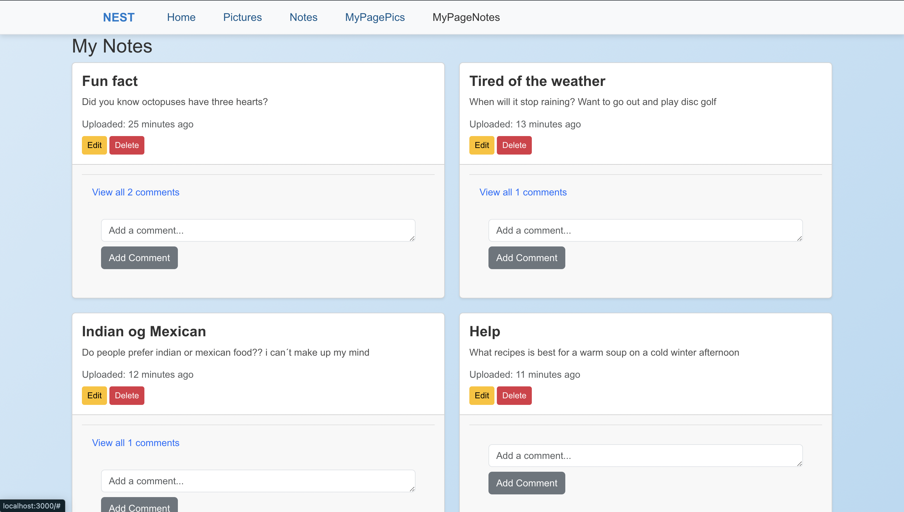
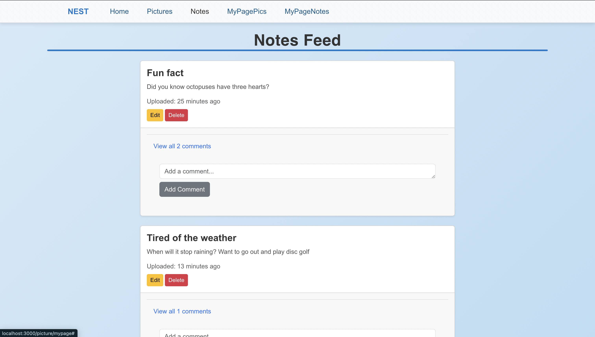
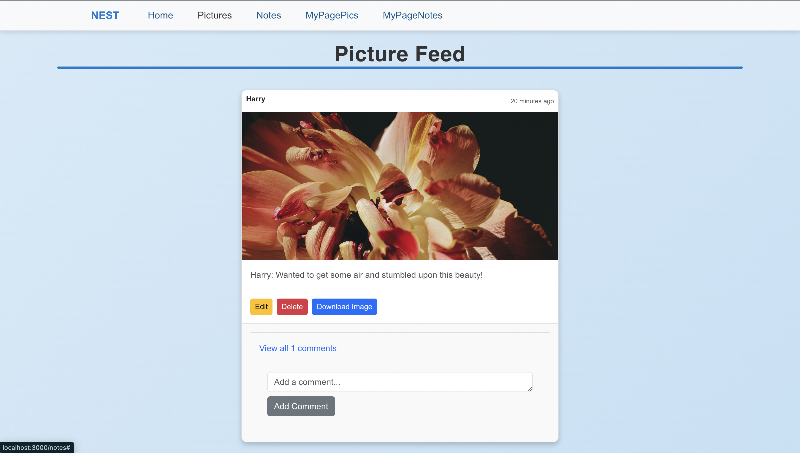

When the code project and code is ready to run, the first step is to start up the project in an IDE. I would recommend using Visual Studio Code, because all the code snippets are imported from VScode, making the steps easier to follow.

1. Open terminal and type in ‘cd api’. We want to start the backend first.

2. Being in the correct directory, type in ‘dotnet build’

3. Finally ‘dotnet run’

4. Open a new terminal (Do not close the terminal after ‘dotnet run’)

5. Type ‘cd frontend’ in the new terminal to access the main application folder.

6. Go into the front end by typing in ‘npm install’ to make everything ready to run.

7. Type in ‘npm start’ to start the application.

Home page;

MyPageNotes:

MyPagePics:

Notes feed:

Picture feed:

